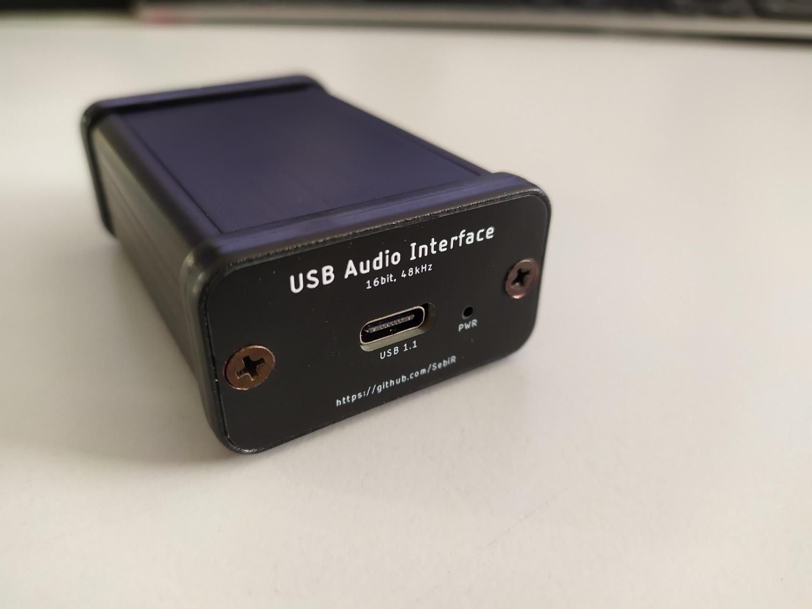
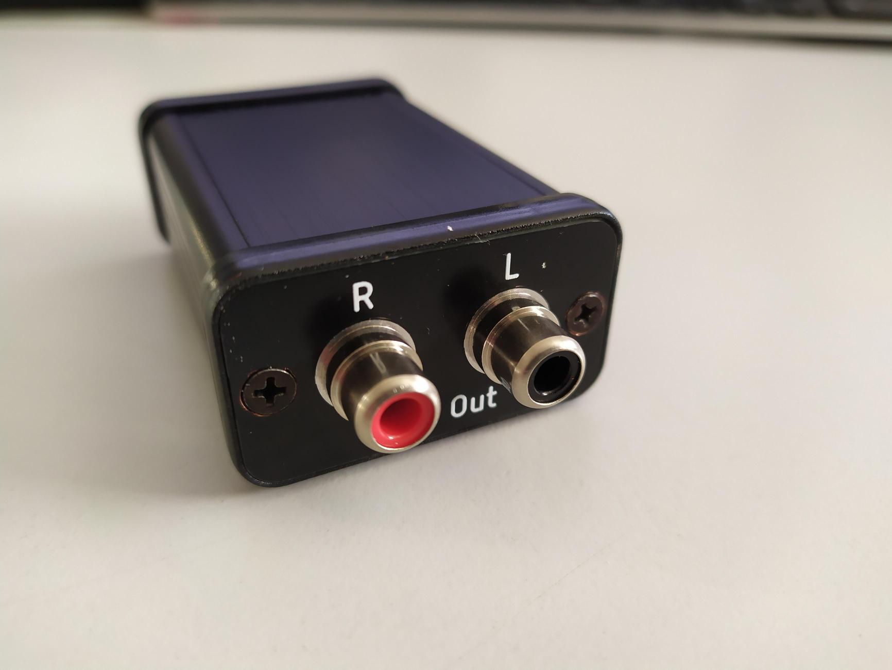
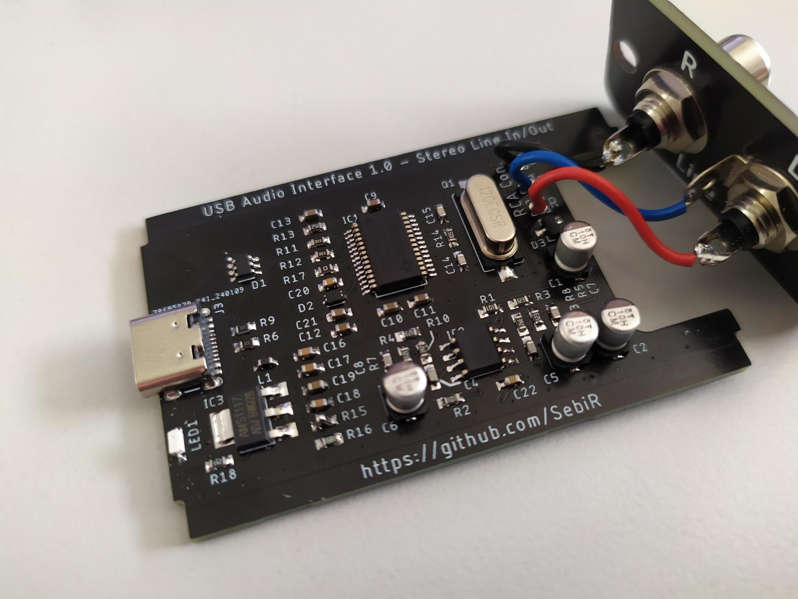
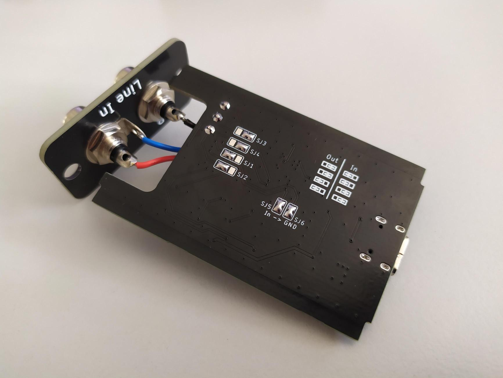

# USB Audio Interface with Line In or Out
A very compact USB sound card with either two line inputs or two line outputs

## Features
* USB-C connector (USB 1.1 standard)
* Can be set to Line Out or Line In with solder jumpers
* The front plate can be flipped for Input or Output labeling
* Bus powered
* With PCB front plates no mechanical work is neccessary (except for some countersinking)

# Inner Workings

The main chip of the audio interface is a PCM2904 from Texas Instruments. It has an in- and output capability of 16bit at 48kHz, enough for most applications.
A high-quality OPA2523 op amp is used as a low-pass filter to get rid of high frequency noise. It's basically a copy of the PCM2902 eval board from TI.

On the underside, there are six SMT solder jumpers. Four of them determine the direction of the input/output LPF, so configuring the device as a Line In or a Line out device.
In case of a Line out configuration, the two inputs can be tied to GND to avoid any noise.

# Case

The PCB and the front plates are designed to fit inside ultra small Hammond 1455D601 metal case.
But if you want to save ~15€, you can download the 3D CAD files for the case and print it for yourself:
https://www.hammfg.com/part/1455D601

Although a nice anodized aluminum case is pretty nifty!

# Maybe?
It would be really nice to be able to change the direction mid-operation, but that would require some analog switches. Maybe I'll create another version somewhere in the future